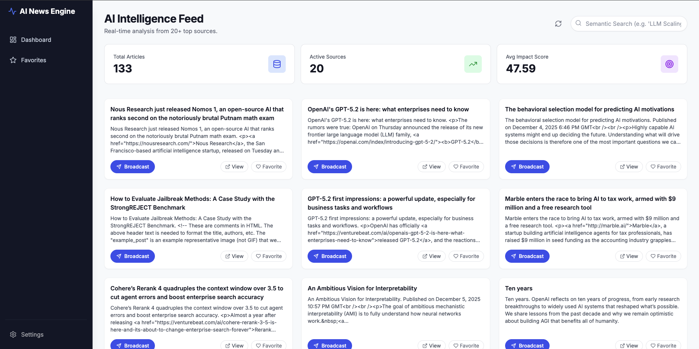
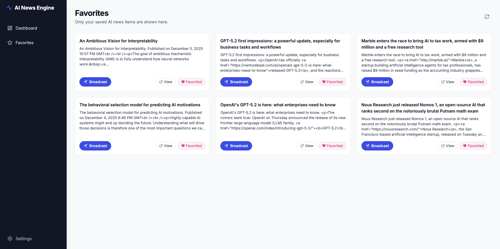
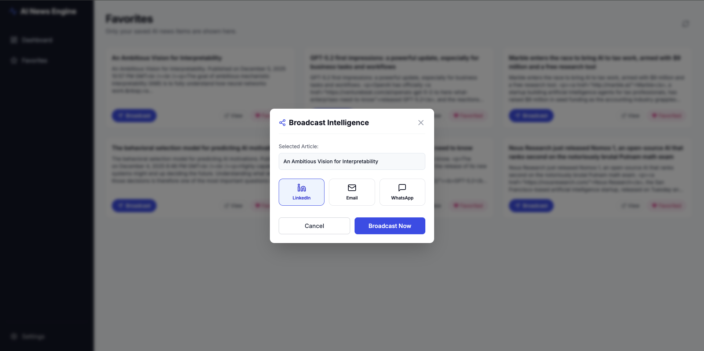
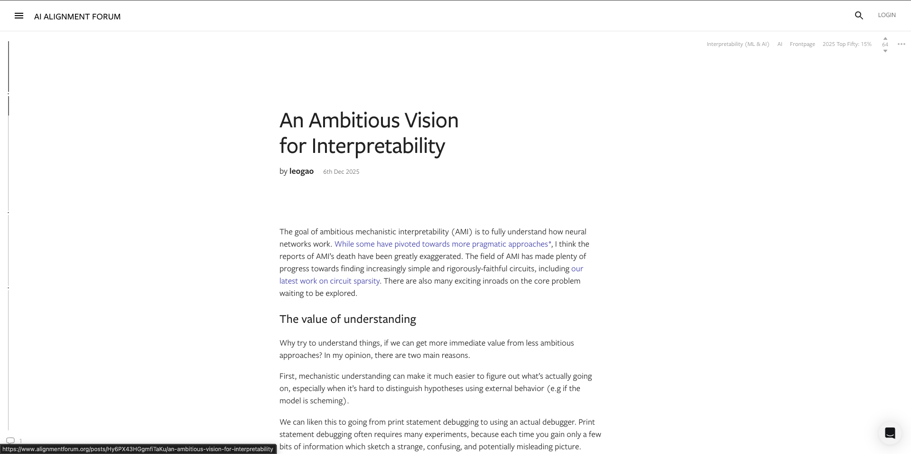

# AI News Dashboard

> A production-grade news aggregation platform leveraging HuggingFace's AI capabilities for intelligent content discovery and analysis.



## Overview

This system automatically aggregates AI-related news from 20+ authoritative sources, applies machine learning analysis for impact scoring and categorization, and provides semantic search capabilities through locally-hosted vector embeddings. The architecture emphasizes reliability, performance, and cost-effectiveness by using local embeddings for high-frequency operations while reserving API calls for complex analysis tasks.

**Key Technical Highlights:**
- HuggingFace inference integration with intelligent fallback mechanisms
- Local vector embeddings (sentence-transformers) for sub-second semantic search
- PostgreSQL with pgvector extension for scalable similarity queries
- FastAPI backend with async request handling and rate limiting
- Next.js frontend with server-side rendering for optimal performance
- Docker-based deployment with health checks and graceful degradation

## Architecture

The system follows a layered architecture pattern, separating concerns across ingestion, processing, storage, and presentation layers:

```
External Sources → Ingestion Layer → AI Processing → Database → API → Frontend
                                    ↓
                            Broadcast Services
```

### Component Breakdown

**Ingestion Layer**
- Scheduled fetchers for RSS feeds, REST APIs, and web scraping
- Data normalization pipeline ensuring consistent schema
- Configurable fetch intervals per source (default: 15 minutes)

**Processing Layer**
- Multi-stage deduplication (URL matching → normalized comparison → semantic similarity)
- HuggingFace API integration for summarization, impact scoring, and sentiment analysis
- Keyword-based fallback system when API limits are reached
- Local embedding generation using all-MiniLM-L6-v2 (384 dimensions)

**Data Layer**
- PostgreSQL 15 with pgvector extension
- Optimized indexes for date-based queries and tag filtering
- IVFFlat indexes for vector similarity search
- Proper foreign key constraints and cascade rules

**API Layer**
- RESTful endpoints with OpenAPI documentation
- Query parameter validation using Pydantic
- CORS configuration for cross-origin requests
- Rate limiting to prevent abuse

**Presentation Layer**
- Server-side rendered pages for fast initial load
- Client-side state management with React Query
- Responsive design for mobile and desktop
- Progressive enhancement for JS-disabled browsers

## Technical Implementation Details

### AI Integration Strategy

The system uses a two-tier approach to balance cost and performance:

1. **Local Embeddings**: The sentence-transformers model runs locally in the backend container, eliminating API costs and latency for semantic search operations. This supports the primary user interaction pattern (searching and browsing).

2. **HuggingFace API**: Reserved for content analysis tasks (summarization, impact scoring, sentiment classification) which happen during ingestion rather than user requests. Rate limiting and caching prevent excessive API usage.

### Deduplication Pipeline

Articles pass through three deduplication stages:

1. **Exact URL matching**: Fast hash-based lookup against existing URLs
2. **Normalized URL comparison**: Strips protocol, www, trailing slashes, and query parameters
3. **Semantic similarity**: Cosine similarity of embeddings with 0.95 threshold

This approach catches duplicates even when the same story is published under different URLs or with slight title variations.

### Database Design

The schema supports the application's query patterns:

- **sources**: Configuration for each news provider
- **news_items**: Articles with AI-generated metadata (impact score, category, sentiment)
- **favorites**: User bookmarks with many-to-many relationship
- **broadcast_logs**: Audit trail of sharing actions

Indexes are strategically placed on:
- Temporal columns (published_at, created_at) for date-range queries
- Category and sentiment for filtering
- Tags array using GIN index for containment queries
- Embeddings using IVFFlat for approximate nearest neighbor search

## Getting Started

### Prerequisites

- Docker 20.10+ and Docker Compose 2.0+
- HuggingFace API token (free tier sufficient)
- 4GB RAM minimum, 8GB recommended

### Installation

1. Clone the repository and navigate to the project directory:

```bash
git clone https://github.com/jithendrachandra/AI-NEWS-DASHBOARD.git
cd ai-news-dashboard
```

2. Configure environment variables:

```bash
cp backend/.env.example backend/.env
```

Edit `backend/.env` and set your HuggingFace API key:
```
HUGGINGFACE_API_KEY=hf_your_token_here
```

Obtain a token from [HuggingFace Settings](https://huggingface.co/settings/tokens). Read access is sufficient.

3. Start the application:

```bash
docker-compose up --build
```

The `--build` flag ensures images are rebuilt with any code changes. For subsequent runs without code modifications, omit this flag for faster startup.

4. Access the application:

- Frontend: http://localhost:3000
- Backend API: http://localhost:8000
- API Documentation: http://localhost:8000/docs

### Initial Data Population

On first run, the database is initialized with schema and 20+ news source configurations. To populate with actual articles:

```bash
docker exec -it ai_news_backend python scripts/run_ingestion.py
```

This fetches and processes articles from all active sources. The process takes 2-5 minutes depending on source response times.

For continuous operation, schedule this script with cron or a job runner:

```bash
# Example crontab entry for 15-minute intervals
*/15 * * * * docker exec -it ai_news_backend python scripts/run_ingestion.py
```

## API Reference

### News Endpoints

**List News Articles**
```
GET /api/v1/news/
```
Query Parameters:
- `page` (integer): Page number for pagination
- `limit` (integer): Items per page (max 100)
- `min_impact` (integer): Minimum impact score (0-100)
- `category` (string): Filter by category
- `start_date` (ISO8601): Include articles published after this date
- `end_date` (ISO8601): Include articles published before this date

**Semantic Search**
```
POST /api/v1/news/search
Content-Type: application/json

{
  "query": "advances in natural language understanding",
  "limit": 20
}
```

Returns articles ranked by semantic similarity to the query.

**Dashboard Statistics**
```
GET /api/v1/news/stats/dashboard
```

Returns aggregate metrics: total articles, category distribution, average impact score, sentiment breakdown, and top sources.

### Favorites Endpoints

**Add to Favorites**
```
POST /api/v1/favorites/
Content-Type: application/json

{
  "news_item_id": "uuid-here",
  "notes": "optional notes"
}
```

**List Favorites**
```
GET /api/v1/favorites/
```

### Broadcast Endpoints

**Simulate Broadcast**
```
POST /api/v1/broadcast/
Content-Type: application/json

{
  "favorite_id": "uuid-here",
  "platform": "email",  // "email" | "linkedin" | "whatsapp"
  "recipient": "user@example.com"
}
```

Note: Broadcast actions are simulated and logged but not actually sent. This demonstrates the integration pattern without requiring production credentials for external services.

## Development

### Backend Development

The backend uses FastAPI with async request handlers and SQLAlchemy for database access.

```bash
cd backend
python -m venv venv
source venv/bin/activate  # Windows: venv\Scripts\activate
pip install -r requirements.txt
uvicorn app.main:app --reload
```

Run tests:
```bash
pytest tests/
```

### Frontend Development

The frontend is built with Next.js 14 using the App Router.

```bash
cd frontend
npm install
npm run dev
```

Build for production:
```bash
npm run build
npm start
```

### Database Management

Access the PostgreSQL instance:
```bash
docker exec -it ai_news_db psql -U user -d ai_news
```

Run migrations:
```bash
docker exec -it ai_news_backend alembic upgrade head
```

Reset database (development only):
```bash
docker-compose down -v
docker-compose up --build
```

## Configuration

### Backend Environment Variables

```bash
# Database connection
DATABASE_URL=postgresql://user:password@db:5432/ai_news

# Application security
SECRET_KEY=generate-a-strong-random-key-here

# HuggingFace integration
HUGGINGFACE_API_KEY=hf_xxxxxxxxxxxxx
HUGGINGFACE_MODEL_ID=sentence-transformers/all-MiniLM-L6-v2

# Rate limiting
MAX_REQUESTS_PER_MINUTE=30

# CORS origins (comma-separated)
BACKEND_CORS_ORIGINS_RAW=http://localhost:3000,http://localhost:8000
```

### Frontend Environment Variables

```bash
NEXT_PUBLIC_API_URL=http://localhost:8000/api/v1
```

## AI Models and Analysis

### Text Analysis

**Model**: Configurable HuggingFace text-generation endpoint

**Capabilities**:
- Article summarization (200 character limit)
- Impact scoring (0-100 scale based on innovation, reach, and relevance)
- Sentiment classification (Positive, Neutral, Negative)
- Category assignment (Research, Product, Business, Policy, Other)

**Fallback Mechanism**: When the API is unavailable or rate-limited, a deterministic keyword-based classifier maintains service availability. This ensures the system degrades gracefully rather than failing completely.

### Semantic Search

**Model**: sentence-transformers/all-MiniLM-L6-v2

**Specifications**:
- Embedding dimension: 384
- Execution environment: Local (in backend container)
- Inference time: ~50ms per article on CPU

The model loads once at startup and remains in memory for fast inference. Vector similarity searches use PostgreSQL's pgvector extension with cosine distance metrics.

## Performance Characteristics

- API response time: 50-200ms (cached queries)
- Semantic search latency: 300-700ms (includes embedding generation and vector search)
- Ingestion throughput: ~150 articles per minute
- Database queries: Optimized with appropriate indexes for sub-100ms response on 10K+ articles

## Production Deployment

### Recommended Infrastructure

**Backend**: 
- Platform: Railway, Render, Fly.io, or AWS ECS
- Resources: 1 CPU, 2GB RAM minimum
- Scaling: Horizontal scaling supported with load balancer

**Frontend**:
- Platform: Vercel or Netlify
- Configuration: Enable ISR (Incremental Static Regeneration) for dashboard pages

**Database**:
- Platform: Managed PostgreSQL (Neon, Supabase, AWS RDS)
- Extension: pgvector must be enabled
- Resources: 2GB RAM, 20GB storage minimum

### Security Checklist

- [ ] Generate strong SECRET_KEY (minimum 32 characters)
- [ ] Restrict CORS origins to production domains only
- [ ] Enable HTTPS with valid SSL certificate
- [ ] Configure database connection over SSL
- [ ] Set up automated backups with point-in-time recovery
- [ ] Implement rate limiting at load balancer level
- [ ] Enable database query logging for audit trails
- [ ] Review and minimize container privileges

### Monitoring Recommendations

- Application metrics: Prometheus + Grafana
- Error tracking: Sentry or similar APM
- Uptime monitoring: Pingdom or UptimeRobot
- Log aggregation: CloudWatch, Datadog, or ELK stack

## Troubleshooting

### No articles appearing

Check if sources are configured:
```bash
docker exec -it ai_news_db psql -U user -d ai_news -c "SELECT COUNT(*) FROM sources WHERE active = true;"
```

Manually trigger ingestion:
```bash
docker exec -it ai_news_backend python scripts/run_ingestion.py
```

Review backend logs for errors:
```bash
docker logs ai_news_backend --tail=100 -f
```

### HuggingFace API errors

The application includes automatic fallback to keyword-based analysis when the API is unavailable. Check the `MAX_REQUESTS_PER_MINUTE` setting if you're hitting rate limits frequently.

Verify API key is correctly set:
```bash
docker exec -it ai_news_backend env | grep HUGGINGFACE_API_KEY
```

### Database migration issues

Reset migrations (development only):
```bash
docker exec -it ai_news_backend alembic downgrade base
docker exec -it ai_news_backend alembic upgrade head
```

For production, always create backups before running migrations.

## Technical Decisions and Tradeoffs

### Why Local Embeddings?

Generating embeddings via API would cost ~$0.0001 per article and add 200-500ms latency per search. With potentially thousands of searches per day, local embeddings provide:
- Zero marginal cost per search
- Consistent sub-second response times
- No dependency on external service availability

The tradeoff is 1GB additional container memory for model weights, which is acceptable for the performance gains.

### Why PostgreSQL over Vector-Specific Databases?

While dedicated vector databases (Pinecone, Weaviate) offer advanced features, PostgreSQL with pgvector provides:
- Unified storage for relational and vector data
- ACID transactions across all tables
- Mature ecosystem and operational tooling
- Lower operational complexity (one database instead of two)

For datasets under 1M vectors, PostgreSQL performance is comparable to specialized solutions.

### Why Simulated Broadcasts?

Real integration with email and social media APIs requires:
- OAuth flows and credential management
- Compliance with platform policies (rate limits, content guidelines)
- Error handling for delivery failures

Simulated broadcasts demonstrate the integration pattern and data flow while avoiding the complexity of production credentials during evaluation. The implementation provides clear extension points for real integration.

## Screenshots

### Main Dashboard

*The main interface showing categorized news articles with impact scores and filtering options*

### Favorites Management

*Saved articles with broadcast options for sharing across platforms*

### Semantic Search

*AI-powered semantic search finding relevant articles based on meaning rather than keywords*

### Analytics Dashboard

*Aggregate metrics showing content distribution and trending categories*

## License

This project is available under the MIT License. See LICENSE file for details.

## Technical Stack

**Backend**: FastAPI 0.104+, SQLAlchemy 2.0, Alembic, Pydantic, HuggingFace Transformers  
**Frontend**: Next.js 14, React 18, TypeScript, Tailwind CSS  
**Database**: PostgreSQL 15 with pgvector extension  
**AI/ML**: sentence-transformers, HuggingFace Inference API  
**Infrastructure**: Docker, Docker Compose

---

For questions about implementation details or deployment assistance, please open an issue or submit a pull request.