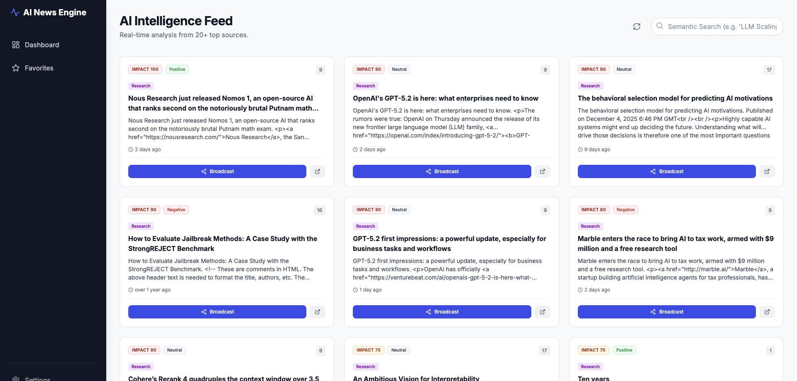
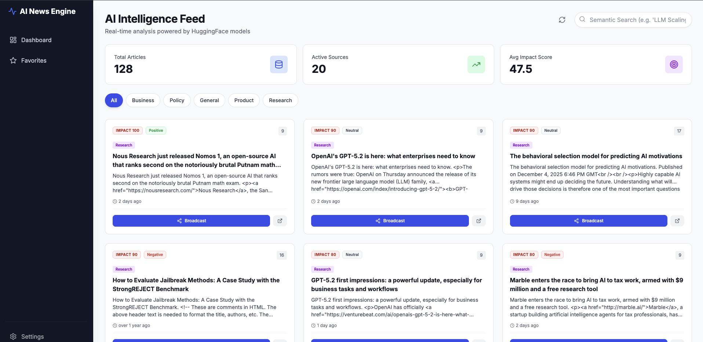
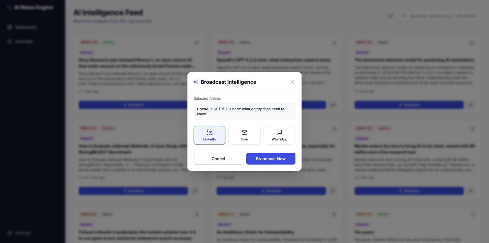
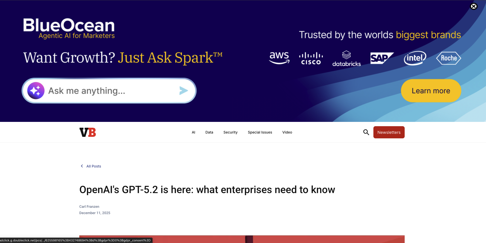

🧠 AI News Dashboard
AI News Aggregation & Broadcasting Dashboard with HuggingFace-powered analysis

✨ Features
📰 Automated News Ingestion from 20+ top AI sources (blogs, RSS, APIs)

🤖 AI-Powered Analysis using HuggingFace Inference API

🔍 Semantic Search with local vector embeddings (all-MiniLM-L6-v2, 384-dim)

📊 Impact Scoring & sentiment analysis with sensible fallbacks

⭐ Favorites & Dashboard with dedicated favorites tab

📣 Broadcast Simulation (Email, LinkedIn, WhatsApp) with clear UI + logs

🎯 Category Filtering (Research, Product, Business, Policy, Other)

⚡ Periodic Updates via ingestion script (can be run every 15 minutes)

🗄️ PostgreSQL + pgvector-ready schema for similarity search

🏗️ Architecture

┌─────────────┐      ┌──────────────┐      ┌─────────────┐
│  20+ AI     │ ---> │  Ingestion   │ ---> │ PostgreSQL  │
│  Sources    │      │  (FastAPI +  │      │ (news, src, │
│  (RSS/APIs) │      │  scripts)    │      │ favorites)  │
└─────────────┘      └──────────────┘      └─────────────┘
                             │
                             │ HuggingFace Inference API
                             │ (Text analysis)
                             ▼
                       ┌──────────────┐
                       │   Backend    │
                       │   (FastAPI)  │
                       └──────────────┘
                             │  REST API
                             ▼
                       ┌──────────────┐
                       │  Frontend    │
                       │  (Next.js)   │
                       └──────────────┘

Ingestion Layer: scripts + API endpoints for fetching, normalizing, and storing news.

Processing: deduplication, summarization, impact scoring, basic clustering.

Broadcast Layer: mocked Email / LinkedIn / WhatsApp calls with detailed logs and responses.

🚀 Quick Start

## 🐳 Running with Docker Compose

This project ships with a ready-to-use `docker-compose.yml` that starts:

- `ai_news_backend` (FastAPI API + ingestion + HuggingFace integration)
- `ai_news_frontend` (Next.js dashboard)
- `ai_news_db` (PostgreSQL database)

### 1. Build images and start services

From the project root (where `docker-compose.yml` lives):

docker-compose up --build

text

- `--build` forces Docker Compose to (re)build the backend and frontend images before starting the containers, so code and Dockerfile changes are picked up. [web:93][web:96]
- Logs from all services will stream in the same terminal.

To run in the background:

docker-compose up -d --build

text

### 2. Stop and clean up

To stop containers but keep data volumes:

docker-compose down

text

To stop and also remove volumes (including the Postgres data):

docker-compose down -v

text

Use `down -v` if you want a completely fresh database and re-run migrations and seeding from scratch. [web:93][web:101]

Prerequisites
Docker & Docker Compose

HuggingFace API Key (free tier is enough)

4GB+ RAM

1. Clone & Configure

git clone https://github.com/jithendrachandra/AI-NEWS-DASHBOARD.git
cd ai-news-dashboard

# Create backend .env file
cp backend/.env.example backend/.env

# Edit backend/.env and add:
# HUGGINGFACE_API_KEY=your_key_here
2. Get HuggingFace API Key
Visit https://huggingface.co/settings/tokens

Create a new token (read access is enough)

Paste it into backend/.env as HUGGINGFACE_API_KEY

3. Start Everything
bash
# Build and start all services
docker-compose up --build

# OR run in detached mode
docker-compose up -d
4. Access the Dashboard
Frontend: http://localhost:3000

Backend API: http://localhost:8000

API Docs (Swagger): http://localhost:8000/docs

📦 What Happens on First Run
✅ PostgreSQL container starts (with schema ready for pgvector if enabled)

✅ Alembic migrations run and create tables (sources, news_items, favorites, etc.)

✅ ~20 AI news sources are seeded into the sources table

✅ Local embedding model (all-MiniLM-L6-v2) loads in the backend

✅ Ingestion script can be triggered to fetch and store latest AI news

For “near real-time” behaviour, you can run the ingestion script on a schedule (e.g., every 15 minutes via cron or a simple scheduler).

🛠️ Manual Operations
Run Migrations
bash
docker exec -it ai_news_backend alembic upgrade head
Seed Sources Manually
bash
docker exec -it ai_news_backend python scripts/seed_sources.py
Trigger News Ingestion (one-off)
bash
docker exec -it ai_news_backend python scripts/run_ingestion.py
You can hook this into a cron/job scheduler to keep the feed fresh.

Test HuggingFace Service
bash
docker exec -it ai_news_backend python scripts/test_huggingface.py
View Logs
bash
# All services
docker-compose logs -f

# Backend only
docker logs ai_news_backend --tail=100 -f

# Frontend only
docker logs ai_news_frontend --tail=100 -f
Database Access
bash
docker exec -it ai_news_db psql -U user -d ai_news

# Useful queries
\dt;
SELECT COUNT(*) FROM news_items;
SELECT * FROM sources LIMIT 10;
🔧 Development
Backend Development
bash
cd backend

python -m venv venv
source venv/bin/activate  # or `venv\Scripts\activate` on Windows

pip install -r requirements.txt
uvicorn app.main:app --reload
Frontend Development
bash
cd frontend

npm install
npm run dev
📚 API Endpoints (MVP)
News
GET /api/v1/news/ – List news (with filters: min_impact, limit, etc.)

GET /api/v1/news/{id} – Get a single news item

POST /api/v1/news/search – Semantic search over news

GET /api/v1/news/categories/list – List available categories

GET /api/v1/news/stats/dashboard – High-level stats (counts, impact, etc.)

Sources
GET /api/v1/sources/ – List all sources

POST /api/v1/sources/ – Add a new news source

Broadcast (Simulated)
POST /api/v1/broadcast/ – Simulate broadcasting a favorite to:

Email

LinkedIn

WhatsApp

The backend logs and API response clearly indicate that the action is simulated, matching the BRD’s “mocked or actual” requirement.​

🎯 Models & AI
Text Analysis
Model: HuggingFace text-generation / LLM endpoint (configurable)

Tasks:

News summarization (short summary)

Impact scoring (0–100)

Sentiment classification (Positive / Neutral / Negative)

Category suggestion (Research / Product / Business / Policy / Other)

Fallback: If the API fails or rate limits, a deterministic keyword-based heuristic is used to avoid junk output.​

Embeddings
Model: sentence-transformers/all-MiniLM-L6-v2

Dimensions: 384

Execution: Loaded locally inside the backend container for fast, offline semantic search.​

🔐 Environment Variables
Backend (backend/.env)
text
# Database
DATABASE_URL=postgresql://user:password@db:5432/ai_news

# Security
SECRET_KEY=your-secret-key-here

# HuggingFace
HUGGINGFACE_API_KEY=hf_xxxxxxxxxxxxx
HUGGINGFACE_MODEL_ID=sentence-transformers/all-MiniLM-L6-v2
HUGGINGFACE_EMBEDDING_MODEL=sentence-transformers/all-MiniLM-L6-v2

# Rate Limiting
MAX_REQUESTS_PER_MINUTE=30

# CORS (comma-separated)
BACKEND_CORS_ORIGINS_RAW=http://localhost:3000,http://localhost:8000
Frontend (frontend/.env.local)
text
NEXT_PUBLIC_API_URL=http://localhost:8000/api/v1
🐛 Troubleshooting
No news appearing?
bash
# Check if sources exist
docker exec -it ai_news_db psql -U user -d ai_news -c "SELECT * FROM sources;"

# Manually trigger ingestion
docker exec -it ai_news_backend python scripts/run_ingestion.py

# Check backend logs
docker logs ai_news_backend --tail=50
HuggingFace API issues?
Free tier has rate limits; the app rate-limits calls via MAX_REQUESTS_PER_MINUTE.​

Embeddings are generated locally; only text analysis uses the API.

If the API is unavailable, the app falls back to deterministic analysis.

Migration / DB issues?
bash
# Reset migrations (dev only)
docker exec -it ai_news_backend alembic downgrade base
docker exec -it ai_news_backend alembic upgrade head

# Or rebuild completely
docker-compose down -v
docker-compose up --build
📈 Production Notes (Optional)
Backend: Railway / Render / Fly.io / ECS

Frontend: Vercel / Netlify

Database: Managed Postgres (Neon / Supabase) with pgvector extension

Checklist:

Use a strong SECRET_KEY

Tighten BACKEND_CORS_ORIGINS_RAW to your production domains

Configure HTTPS, monitoring, and backups

Use separate env files for dev/stage/prod

🤝 Contributing
Fork the repository

Create a feature branch

Implement changes (with tests where appropriate)

Open a Pull Request

Built with ❤️ using FastAPI, Next.js, PostgreSQL, and HuggingFace.